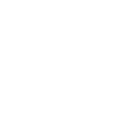
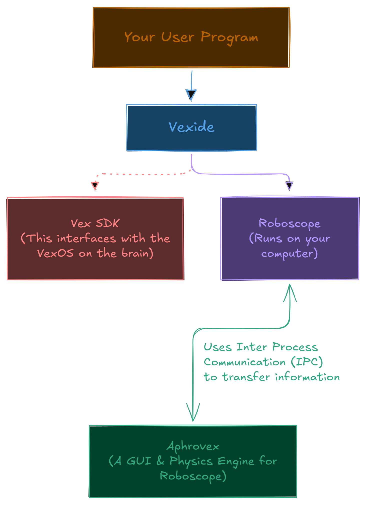

  

    

<h1 align="center" style="margin-top: -50px;">Αφροβέξ</h1>

A Simulator Frontend for [Vexide](https://vexide.dev) programs based on
[Roboscope](https://github.com/vexide/roboscope)

# What does Aphrovex do & how does it work?
Aphrovex provides a GUI and physics simulator(not yet) which can be hooked up with
[Roboscope](https://github.com/vexide/roboscope). Here's how things work:

    

# Features
Aphrovex currently implements the following features:

 - Full Smart Motor support
 - Full Distance Sensor support
 - Full Display support
 - Unit Preferences
 - Themes!!!

# Current Status
Currently, Aphrovex is only a GUI for Roboscope. However, there are many plans
and ideas that have yet to come. Some of which include:

 - A Physics Sim (definitely coming soon)
 - Lua Scripting (will be released with the physics sim)
 - PROS support (depends on feasibility)

Note: The following feature(s) will not be implemented:

 - Serial Device Connection (completely separate system)
